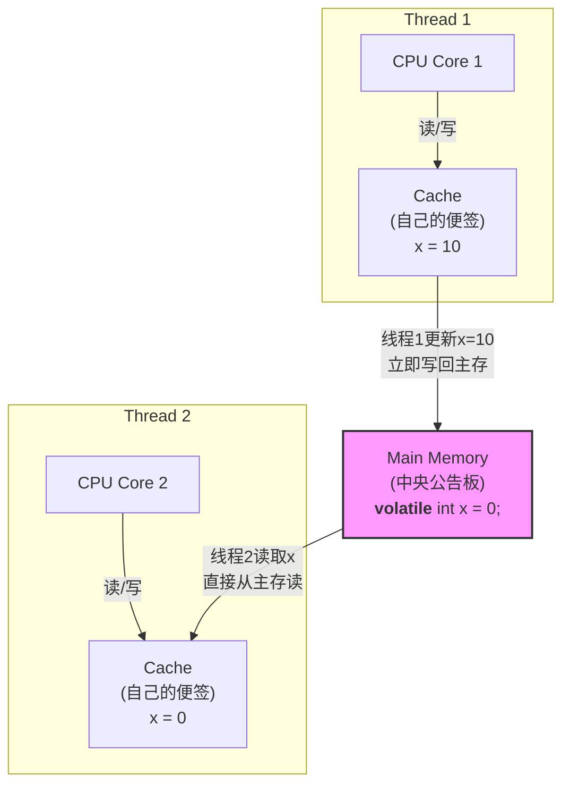

# 设计模式：单例模式 (Singleton Pattern)

单例模式的核心思想是：**保证一个类只有一个实例，并提供一个全局访问点来获取这个实例。**

## 1. 饿汉式 (Eager Initialization)

这是最简单的实现方式。它在类被加载到内存时就立即创建实例，因此是线程安全的。

*   **优点**: 实现简单，线程安全。
*   **缺点**: 如果实例创建很耗资源，且程序不一定会使用它，会造成资源浪费。

```java
public class Logger {
    // 1. 类加载时就创建唯一实例
    private static final Logger instance = new Logger();

    // 2. 私有化构造函数
    private Logger() {}

    // 3. 提供全局访问点
    public static Logger getInstance() {
        return instance;
    }
}
```

## 2. 懒汉式 - 双重检查锁定 (Lazy Initialization with Double-Checked Locking)

为了解决饿汉式的资源浪费问题，懒汉式在第一次被调用时才创建实例。但简单的懒汉式存在线程安全问题。以下是结合了"双重检查锁定"和 `volatile` 关键字的最终、工业级实现方案。

*   **优点**: 按需加载，节约资源，性能高，线程安全。
*   **缺点**: 实现相对复杂，需要正确理解 `volatile` 和 `synchronized`。

```java
public class LazyLogger {
    // 1. 使用 volatile 禁止指令重排
    private static volatile LazyLogger instance;

    // 2. 私有化构造函数
    private LazyLogger() {}

    // 3. 提供全局访问点
    public static LazyLogger getInstance() {
        // 第一次检查：如果实例已存在，直接返回，避免不必要的加锁
        if (instance == null) {
            // 使用类对象作为锁
            synchronized (LazyLogger.class) {
                // 第二次检查：防止多个线程同时通过第一次检查，并重复创建实例
                if (instance == null) {
                    instance = new LazyLogger();
                }
            }
        }
        return instance;
    }
}
```

---

# 深度解析：volatile 关键字

想象一下，我们的大楼里有一块中央公告板（这就是我们的主内存），所有的员工（线程）都需要从上面获取最新的通知。但是，每个员工都很忙，他们不会每次都跑去中央公告板看。为了效率，每个员工都会在自己的工位上放一张便签纸（这就是CPU的高速缓存）。他们会把公告板上的信息抄在自己的便签纸上，下次就直接看自己的便签纸了，这样快得多。

### 1. 可见性 (Visibility)

**没有 `volatile` 的情况：**

1.  管理员在中央公告板（主内存）上更新了通知："下午3点开会"。
2.  员工A（线程A）路过，看了一眼，把"下午3点开会"抄在了自己的便签（缓存）上。
3.  管理员又更新了通知："会议取消"。
4.  员工B（线程B）路过，看到了新通知"会议取消"，并更新了自己的便签。
5.  这时，员工A对他工位的同事说："咱们3点要去开会了"，因为他看的是自己那张**过时**的便签，他根本**不知道**中央公告板上的信息已经变了。

**这就是"可见性"问题**：一个线程对共享变量的修改，另一个线程不能立即"看到"。

**加上 `volatile` 之后：**

`volatile` 就像一个神奇的规定：
*   **读取时**：每次看这个通知时，都**不许**看自己的便签（缓存），必须直接去中央公告板（主内存）上看最新版本。
*   **写入时**：一旦你更新了通知，必须**立即**把它贴到中央公告板上，并且让所有正在看公告板的人都知道"这里更新了！"。

通过这种方式，`volatile` 保证了所有线程在任何时候访问这个变量时，读到的都是主内存中最新鲜、最正确的值，从而解决了可见性问题。



---

### 2. 禁止指令重排 (Instruction Reordering)

这是 `volatile` 更深层次，也是在"双重检查锁定"单例模式中起到决定性作用的功能。

我们之前提到，`instance = new LazyLogger();` 这行代码不是一步完成的，它有三个步骤：
1.  **`mem = allocate()`**: 分配对象的内存空间。
2.  **`ctor(mem)`**: 调用构造函数，初始化对象。
3.  **`instance = mem`**: 将 `instance` 变量指向分配的内存地址。

正常情况下，这三步的顺序是 `1 -> 2 -> 3`。

**没有 `volatile` 的情况：**

CPU和JVM为了追求极致的性能，可能会觉得"我先把第3步办了，让 `instance` 指向那个地址，然后再慢慢地执行第2步去初始化，这样可能更快一点"。这就是**指令重排**，执行顺序变成了 `1 -> 3 -> 2`。

现在，最糟糕的情况发生了：
*   线程A执行到 `1 -> 3`，`instance` 变量已经指向了一块内存，所以 `instance` **已经不为 null** 了。但是，这块内存里的对象还是个"半成品"，因为第2步的初始化还没做。
*   就在此时，线程B来了，它执行第一个 `if (instance == null)`。它发现 `instance` 不是 `null`，于是直接返回了这个 `instance`。
*   线程B拿到了一个没有被完全初始化的"半成品"对象，当它去使用这个对象时，就会立刻报错。

**加上 `volatile` 之后：**

`volatile` 就像是在这行代码前后都画上了一条"红线"，它告诉编译器和CPU：
> "红线前面的所有操作（分配内存、初始化），必须全部完成后，才能执行红线后面的操作（赋值给instance引用）。"

它建立了一个"内存屏障"，严格禁止了这种能够导致错误的重排序。这就保证了任何线程在拿到 `instance` 时，这个 `instance` 一定是一个完完整整、初始化完毕的对象。

### 总结

*   **`volatile` vs `synchronized`**:
    *   `volatile` 是一个轻量级的同步机制，它只保证**可见性**和**禁止指令重排**，但它**不能**保证原子性（比如 `i++` 这种复合操作）。
    *   `synchronized` 是一个重量级的同步机制，它能保证**可见性**和**原子性**，但性能开销更大。
